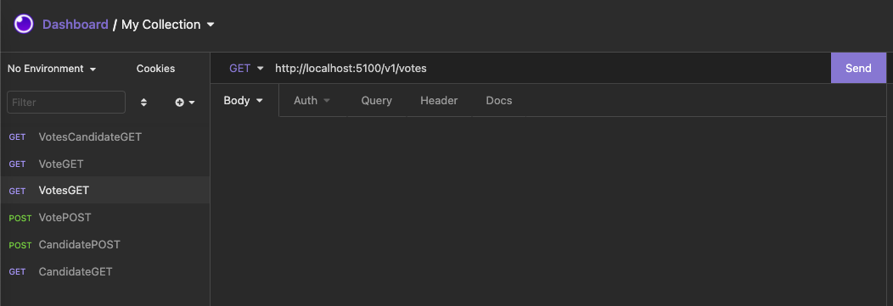
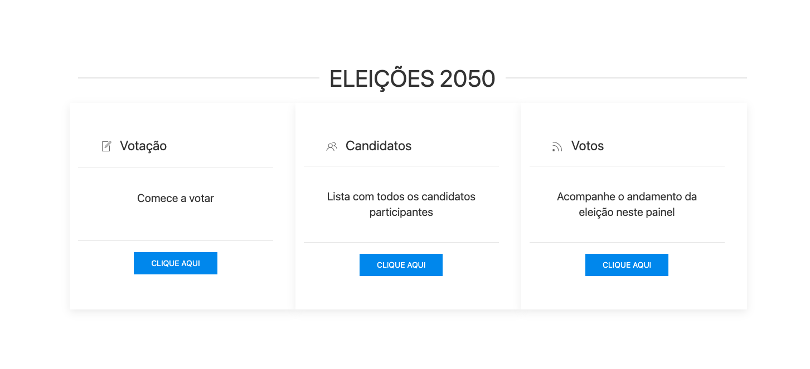

URNA ELETRÔNICA
---

###Resumo

Experimento e estudos de criação de API e um SPA para testes de consumo dos dados.

###Etapas para realizar o teste

- Faça a clonagem deste repositório
- Abra a IDE que achar mais confortável para edição do código (Visual Studio, VS Code, RIDER etc).
- No terminal integrado da IDE verifique se está com o SDK do .Net instalado usando o comando abaixo:
  ```C#
  dotnet --version
  ```
- Se o comando retornar algum resultado como **dotnet v5.#.#** poderemos continuar o processo de testes, caso dê algum erro, recomendo que baixe o SDK do .Net neste link https://dotnet.microsoft.com/download
- Com o dotnet SDK instalado, novamente no Terminal integrado insira o código abaixo para ativar a API:
  ```C#
  dotnet run
  ```
- Nas pastas deste repositório encontram-se coleções de requisições REST, onde poderá utilizar em aplicativos como Insomnia, Postman, ThunderClient etc.
- Após importar a coleção em seu aplicativo preferido terá uma aparência como a imagem abaixo:
  
  - **Passos importantes!!**
    - Siga a sequência de inserções: obs.: Troque as informações nos valores do JSON
      - [CandidatePOST]
        ```
        {
          "FullName": "Uncle Bob",
          "ViceName": "Chuck",
          "RegisterDate": "",
          "Label": 20
        }
        ```
      - [VotePOST]
      ```
      {
        "CandidateId": 1,
        "VoteDate": ""
      }
      ```
      - [CandidateGET] - Verifica todos os Candidatos cadastrados
      - [VotesGET] - Verifica todos os votos realizados
      - [VotesCandidateGET] - Verifica todos os votos POR Candidato, utilizando como parâmetro o CandidateId
      
- Ao inserir as informações acesse o arquivo ***index.html*** para acessar a SPA Urna Eletrônica
- Irá se deparar com algo algo do tipo:
 
  - obs.: Página em construção :rocket: ... não estranhe por enquanto :eyes:

###Considerações

Este foi um pequeno desafio, bem interessante para praticar e aplicar alguns conceitos no Backend com .Net quanto no Frontend (essa parte foi pura gambiarra :eyes: :rofl:).

Em breve irei finalizar este projeto :beers:
